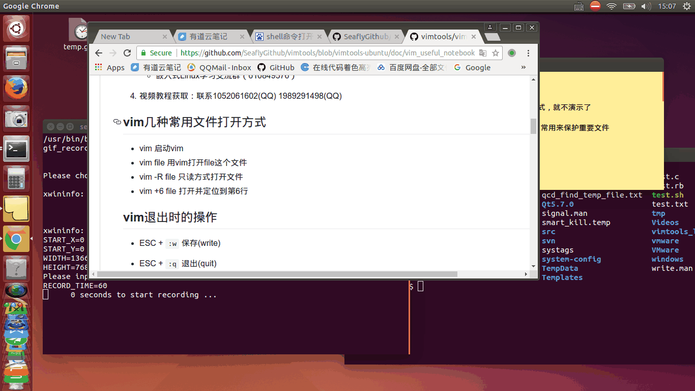

- [视频介绍](#视频介绍)
- [获取vimtools工具包](#获取vimtools工具包)
- [vim几种常用文件打开方式](#vim几种常用文件打开方式)
- [vim退出时的操作](#vim退出时的操作)
- [vim方向键的熟悉](#vim方向键的熟悉)
- [vim方向键的熟悉](#vim方向键的熟悉)
- [vim编辑模式和命令模式的切换](#vim编辑模式和命令模式的切换)
- [vim进入编辑模式的几种常用方式](#vim进入编辑模式的几种常用方式)
- [vim设置行号显示和取消行号显示](#vim设置行号显示和取消行号显示)
- [字母大小写](#字母大小写)
- [改变字体大小](#改变字体大小)
- [行内容选择](#行内容选择)
- [全选该文件内容](#全选该文件内容)
- [特定内容选择（块选择）](#特定内容选择（块选择）)
- [复制和粘贴选中的特定内容](#复制和粘贴选中的特定内容)
- [剪切选中的特定内容](#剪切选中的特定内容)
- [粘贴复制或剪切的内容](#粘贴复制或剪切的内容)
- [删除选中的特定内容](#删除选中的特定内容)
- [删除该行](#删除该行)
- [删除单词或词块](#删除单词或词块)
- [连续向后删除n个字符](#连续向后删除n个字符)
- [删除光标到行尾位置内容](#删除光标到行尾位置内容)
- [删除光标到行首位置内容](#删除光标到行首位置内容)
- [连续向下删除5行内容](#连续向下删除5行内容)
- [删除光标到第一行所有数据](#删除光标到第一行所有数据)
- [删除光标到最后行的所有数据](#删除光标到最后行的所有数据)
- [合并当前行和下一行内容](#合并当前行和下一行内容)
- [代码块格式对齐缩进](#代码块格式对齐缩进)
- [代码块语法自动缩进](#代码块语法自动缩进)
- [撤销和反撤销操作](#撤销和反撤销操作)
- [一行中的内容的快速定位](#一行中的内容的快速定位)
- [单词或词块操作](#单词或词块操作)
- [文件内容特定行定位](#文件内容特定行定位)
- [文件内容文件头和文件尾定位](#文件内容文件头和文件尾定位)
- [文件内容翻屏浏览](#文件内容翻屏浏览)
- [文件名缓冲区定位](#文件名缓冲区定位)
- [错误信息窗口](#错误信息窗口)
- [重复执行上一次操作](#重复执行上一次操作)
- [批量自动缩进](#批量自动缩进)
- [代码折叠相关操作（选学）](#代码折叠相关操作（选学）)
- [垂直分割窗口与水平分割窗口](#垂直分割窗口与水平分割窗口)
- [让光标在多窗口中遨游](#让光标在多窗口中遨游)
- [调整窗口布局](#调整窗口布局)
- [关闭当前窗口（针对多窗口）](#关闭当前窗口（针对多窗口）)
- [打开新文件（针对多文件或多窗口）](#打开新文件（针对多文件或多窗口）)
- [和Linux系统交互(执行外部命令)](#和Linux系统交互（执行外部命令）)

## 视频介绍

1. 最多一首歌的时间讲完一个知识点；
2. 由于视频占用时间少，因此视频文件占用空间会比较小，方便碎片化时间下载和观看学习；
3. 实践 > 视频教程 > 学习笔记 > 资料书

## 获取vimtools工具包

1. 由于本人目前用的是ubuntu系统，因此vimtools目前更趋向于支持ubuntu (2017)
2. 去后面这个地址获取下载安装：https://github.com/SeaflyGithub/vimtools/tree/vimtools-ubuntu
3. 学习交流群：
    - 嵌入式职场加油站（262047367）、
    - 嵌入式Linux学习交流群（610849576）
    - 开源Linux技术交流（159879504）
    - 操作系统开发交流群（148177180）

4. 视频教程获取：联系1052061602(QQ)  1989291498(QQ)

## vim几种常用文件打开方式

- vim					启动vim
- vim  file			用vim打开file这个文件
- vim  -R  file		只读方式打开文件
- vim  +6  file		打开并定位到第6行

## vim退出时的操作

- ESC  +  `:w`				保存(write)
- ESC  +  `:q`				退出(quit)
- ESC  +  `:wq`             保存并退出
- ESC  +  `:wq!`			强制保存并退出
- ESC  +  `:q!`				强制退出

- ESC  +  `:wall`           一次性保存所有编辑
- ESC  +  `:wall!`			
- ESC  +  `:qall`           一次性退出所有编辑
- ESC  +  `:qall!`
- ESC  +  `:wqall`          一次性保存并退出所有编辑
- ESC  +  `:wqall!`

## vim方向键的熟悉

ESC+ (上下左右)     --> ESC+(kjhl)

## vim编辑模式和命令模式的切换

- vim有2种模式，一种是命令模式，一种是编辑模式；
- 通俗讲，我们能向文件中敲入东西的时候即为编辑模式。否则为命令模式。
- 进入命令模式只要按一次或多次ESC键。

## vim进入编辑模式的几种常用方式

- 命令模式ESC  +  编辑模式（i, a, A, o, O）
- 进入编辑模式则有以下三种：

        ESC  +  i			输入之后就从该光标前插入。
        ESC  +  I			输入之后就从该行首插入。
        ESC  +  a			输入之后就从该光标后插入。
        ESC  +  A			输入之后就从该行末尾插入。
        ESC  +  o			输入之后就在该行下新增一行并把光标移到新增行开头插入。
        ESC  +  O			输入之后就在该行上方新增一行并把光标移到新增行开头插入。

## vim设置行号显示和取消行号显示

- 显示行号：ESC  +  `:set  number` 或 `:set  nu`
- 取消行号：ESC  +  `:set  nonumber` 或 `:set  nonu`

## 字母大小写

- 查找时忽略大小写：`set  ic`
- 查找时不忽略大小写：`set  noic`
- 改变字母大小写: ESC  +  ~

## 改变字体大小

- 增大字体： ESC  +  Ctrl  +  +		（Ctrl  +  shift  +  =）
- 减小字体： ESC  +  Ctrl  +  -

## 行内容选择

ESC  +  V  +  <h,j,k,l>

## 全选该文件内容

ESC  +  V  +  G

## 特定内容选择（块选择）

ESC  +  <Ctrl-v>  +  {h,j,k,l}

## 复制和粘贴选中的特定内容

- 复制命令yw和yy的区别：

	命令yy:行复制

	命令yw:单词复制或特定内容复制。

- ESC  +  <Ctrl-v>   +  {h,j,k,l}  +  yw      			用p命令来粘贴
- ESC  +  V  +  {h,j,k,l}  +  yw							用p命令来粘贴

## 剪切选中的特定内容

- ESC  +  <Ctrl-v>   +  {h,j,k,l}  +  c  +  ESC      			用p命令来粘贴
- ESC  +  V  +  {h,j,k,l}  +  c  +  ESC							用p命令来粘贴

## 粘贴复制或剪切的内容

ESC  +  p

用p命令来粘贴

## 删除选中的特定内容

- ESC  +  <Ctrl-v>  +  x
或
- ESC  +  <Ctrl-v>  +  d
或
- ESC  +  V  +  d

## 删除该行

- ESC  +  dd
或
- ESC  +  V  +  d
或
- ESC  +  V  +  x

## 删除单词或词块

ESC  +  dw

## 连续向后删除n个字符

ESC  +  nx

例如输入   6x命令

## 删除光标到行尾位置内容

ESC  +  `d$`

## 删除光标到行首位置内容

ESC  +  d0

## 连续向下删除5行内容

- ESC  +  5dd
或
- ESC  +  V  +  d

## 删除光标到第一行所有数据

ESC  +  d1G

## 删除光标到最后行的所有数据

ESC  +  dG

## 合并当前行和下一行内容

ESC  +  J

## 代码块格式对齐缩进

ESC  +  <Ctrl + v>  +  >

## 代码块语法自动缩进

ESC  +  V +  =

## 撤销和反撤销操作

- 撤销操作：ESC  +  u						（undo）
- 返回撤销：ESC  +  <Ctrl + r>			（redo）

## 一行中的内容的快速定位

如下行内容：
一行内容中光标定位操作:ESC:`0.....^.......$`
（分别表示定位到行首,非空,行尾）

例如：

    hello world! Nice to meet you !

## 单词或词块操作

- 到下一个单词开头:ESC: w 或 W
- 到下一个单词结尾:ESC: e 或 E
- 到前一个单词开头:ESC: b 或 B

- 从当前位置拷贝到本单词的最后一个字符:ESC: `ye`,常用`yw`代替前者。
- 匹配高亮光标当前所在的单词:ESC: # 和 * 分别是向上一个匹配和向下一个匹配

例如：

    hello world! Nice to meet you ! user_password

## 文件内容特定行定位

行定位：

    ESC  +  :16	    定位到第16行

函数定位：

    ESC  +   [[     其中[[表示跳到上一个函数开头,]]表示跳到下一个..

## 文件内容文件头和文件尾定位

- 文件头定位：ESC  +  `:1`  or `1gg`  or  `1G`
- 文件尾定位：ESC  +  `G`

## 文件内容翻屏浏览

- 向上翻屏：ESC  +  <Ctrl-b>
- 向下翻屏：ESC  +  <Ctrl-f>
- 定位到当前编辑区页首：ESC + H     (head)
- 定位到当前编辑区页中：ESC + M     (middle)
- 定位到当前编辑区页尾：ESC + L     (tail)
- 匹配括号移动: %

## 文件名缓冲区定位

- 比如我们的test.c在缓冲区标签为[283:test.c]
- 我们要跳转到该标签可以：
`:b 283`
`:b test.c` 
`:bd 283`       代表删除283号标签
`:bd 12 15 16`    代表删除12,15,16号标签

## 错误信息窗口

- ESC  +  :Asyncrun  make
- ESC  +  :copen [line]
- ESC  +  :cp
- ESC  +  :cn
- ESC  +  :cclose

## 重复执行上一次操作

. 命令

## 批量自动缩进

- 批量自动缩进局部代码： ESC  +  V  +  =
- 批量自动缩进全文代码： ESC  +  VG +  =

## 代码折叠相关操作（选学）

- 折叠命令：

        zf  创建折叠，可以按照前面的方式进行折叠，也可以选中代码后进行折叠。  
        zF  在当前行创建折叠。当一开始就计划要折叠所写代码的时候，可以用该命令创建一对折叠符号，然后再往里面填写内容。
        :5,10fo  在vim中运行该命令会在折叠 5-10 行中的代码。
        zd  删除光标下的折叠。
        zD  删除光标下的折叠，以及嵌套的折叠。
        zE  删除窗口内的所有折叠。仅当 manual 和 marker 折叠方法下有效。

- 打开和关闭折叠：

        zo  打开光标下的折叠。
        zO  打开光标下的折叠，以及嵌套的折叠。
        zc  关闭光标下的折叠。
        zC  关闭光标下的折叠，以及嵌套的折叠。
        za  当光标在关闭折叠上时，打开之。在打开折叠上时，关闭之。
        zA  和za类似，不过对当前折叠和其嵌套折叠都有效。
        zv  打开当前光标所在折叠，仅打开足够的折叠使光标所在的行不被折叠。

- 在折叠间移动：

        [z  到当前打开折叠的开始。如果已在开始处，移到包含这个折叠的折叠开始处。
        ]z  到当前打开折叠的结束。如果已在结束处，移到包含这个折叠的折叠结束处。
        zj  把光标移动到下一个折叠的开始处。
        zk  把光标移动到前一个折叠的结束处。

## 垂直分割窗口与水平分割窗口

- ESC  +  <c-w-v>				打开垂直分割窗口
- ESC  +  <c-w-s>				打开水平分割窗口 

## 让光标在多窗口中遨游

切换分割窗口焦点: ESC  +  <Ctrl-w>  +  {kjhl}（上下左右）

## 调整窗口布局

- 调节窗口高度: <Ctrl-w> {+或-}

        `:help resize`
        `:resize +8`
        `:resize -8`
        `:resize 8`
        Ctrl + w + -：将当前窗口的高度减少一行
        Ctrl + w + +：将当前窗口的高度增加一行

- 调节窗口宽度：

        <c-w> >
        <c-w> <

## 关闭当前窗口（针对多窗口）

- 任何退出编辑的命令都可以关闭窗口，象 ":quit" 和 "ZZ" 等。但 ":close" 可
- 以避免你在剩下一个窗口的时候不小心退出 Vim 了。(十分重要的设定啊～)
- 常用：`:q` or `:close`

## 打开新文件（针对多文件或多窗口）

- 打开文件：`:edit newfile`
- 关闭文件：`:q` or `:close`

## 和Linux系统交互(执行外部命令)

    :!pwd		Execute the pwd command, then returns to vi
    :!!pwd		Execute the pwd command and insert output in file
    :sh			Temporary returns to Unix
    $exit		Returns to vi
